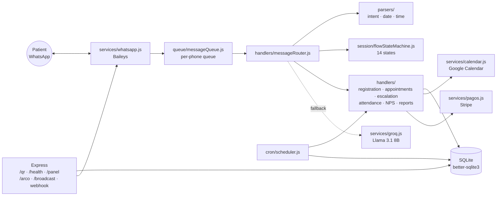

[Español](README.md) · **English**

# WhatsApp Bot — AI Receptionist for a Medical Practice


A conversational WhatsApp bot that works as the virtual front desk for a Mexican medical clinic. It handles the entire patient journey over chat — sign-up, booking appointments with two-way Google Calendar sync, reminders, satisfaction surveys, deposit collection, and doctor notifications — all in natural Spanish, driven by a hand-written intent parser with an LLM (Groq) as a conversational fallback.

The problem it solves: small clinics lose bookings and burn staff time answering the same WhatsApp messages all day. This bot answers instantly, books straight into the doctor's calendar, and escalates to a human only when it genuinely needs to.

> **Note**: this project runs on Baileys, an unofficial WhatsApp client. For large-scale production use, migrating to an official Business Solution Provider (WATI, Gupshup, 360dialog) is recommended.

---

## Features

### End-to-end appointment handling
- Conversational **patient registration** (name, date of birth) with recovery from dropped sessions.
- **Book, reschedule, cancel, and look up appointments** using natural Mexican Spanish ("day after tomorrow at half past five", "Tuesday afternoon").
- **Google Calendar sync**: tentative events with a TTL while the patient confirms, free/busy availability checks, and automatic cleanup of orphaned tentative holds on restart.
- Interactive WhatsApp **buttons and lists** (main menu, confirmations, time-slot selection) with a plain-text fallback.

### Automated reminders and follow-up
- Appointment reminders **24 h and 2 h ahead** (cron runs every 5 minutes).
- **Attendance check**: after the appointment, the bot asks the doctor whether the patient showed up.
- Daily **birthday greetings** at 9:00 AM.
- **Post-visit NPS survey** sent daily at 7:00 PM.

### Doctor notifications
- A pre-visit report with the patient's **reason for the visit**.
- **Human escalation**: on emergencies or an explicit request, the bot alerts the doctor and stays silent for 30 minutes.
- **Symptom triage**: emergency messages (chest pain, difficulty breathing) are escalated rather than booked.
- An operational alert fires when the LLM fallback rate crosses a threshold (a sign the parser is missing intents).

### Hybrid NLP (custom parser + LLM)
- An **`intentParser`** covering 18+ intents and Mexican idioms, plus dedicated parsers for Spanish dates, times, and numbers.
- **Groq (`llama-3.1-8b-instant`)** as a conversational fallback with a defined persona ("Valentina", an empathetic receptionist) and hard guardrails: it never diagnoses and never invents appointments.
- A 14-state machine governs every conversational flow (session TTL: 10 min).

### Web panel and metrics
- A **KPI dashboard** (`/panel` as JSON, `/panel.html` with charts): intents, fallbacks, appointments created/cancelled, reschedules, escalations, emergencies, and 7-day fallback rate.
- **Daily time series** for charting (`/api/panel/series`, up to 180 days).
- Metrics persisted to SQLite per event (detected intent, fallback, payment, escalation, and so on).

### Legal compliance (LFPDPPP, Mexico)
- A public, versioned **privacy notice** (`/aviso-privacidad`).
- **Explicit opt-in** with the consent version recorded.
- **ARCO rights**: opt-out over WhatsApp (keyword) plus endpoints for data access and deletion.

### Payments and broadcasts
- **Deposits via Stripe Checkout** (optional, configurable in cents) with a signed webhook and automatic appointment confirmation on payment.
- **Segmented broadcasts** gated behind a prior-consent check.

---

## Architecture



**Message lifecycle**: Baileys receives the message → it is queued per phone number (avoiding race conditions) → the router normalizes interactive replies, loads the session, and detects the intent → the handler for the active flow responds → if nothing matches, Groq generates a bounded reply. Every error is caught, so the patient always gets a response.

---

## Project structure

```
bot-asistente-medica-whatsapp/
├── src/
│   ├── index.js               # Entry point: WhatsApp, cron, HTTP server
│   ├── config/
│   │   ├── env.js             # Loads and validates environment variables
│   │   └── constants.js       # States, timeouts, Groq model
│   ├── handlers/              # Business logic, one module per flow
│   │   ├── messageRouter.js   # Main orchestrator
│   │   ├── registrationFlow.js
│   │   ├── appointmentFlow.js
│   │   ├── reminderHandler.js
│   │   ├── attendanceHandler.js
│   │   ├── birthdayHandler.js
│   │   ├── escalationHandler.js
│   │   ├── npsHandler.js
│   │   └── reportHandler.js
│   ├── parsers/               # Spanish NLP (no LLM dependency)
│   │   ├── intentParser.js    # 18+ intents
│   │   ├── dateParser.js      # "day after tomorrow", "on Tuesday"...
│   │   ├── timeParser.js      # "half past five", "in the afternoon"...
│   │   ├── spanishNumbers.js
│   │   └── textNormalizer.js
│   ├── services/
│   │   ├── whatsapp.js        # Baileys: connection, filters, buttons/lists
│   │   ├── groq.js            # LLM fallback with a bounded system prompt
│   │   ├── calendar.js        # Google Calendar (tentative holds + free/busy)
│   │   ├── pagos.js           # Stripe Checkout
│   │   └── broadcast.js       # Segmented broadcasts with consent checks
│   ├── session/
│   │   ├── sessionManager.js  # Sessions with a 10-min TTL
│   │   └── flowStateMachine.js
│   ├── database/
│   │   ├── db.js · migrate.js
│   │   ├── migrations/        # 001-009 (schema, metrics, NPS, payments...)
│   │   └── repositories/      # patient · appointment · doctor · session · metrics · NPS · payment
│   ├── queue/messageQueue.js  # Per-contact message serialization
│   ├── cron/scheduler.js      # Reminders, birthdays, NPS, alerts
│   └── utils/                 # Logger, message templates, date helpers
├── public/panel.html          # KPI web dashboard
├── scripts/migrate-from-sheets.js  # Patient import from Excel
├── docs/                      # Operator manual
└── tests/                     # Test suite (see below)
```

---

## Requirements

- **Node.js ≥ 24** (works from 18, but the project is developed and tested on 24; `better-sqlite3` v12.x is required for Node 24)
- A dedicated WhatsApp number for the bot
- A [Groq](https://console.groq.com) account (free tier: 14,400 requests/day)
- *(Optional)* A Google Cloud service account with access to Calendar API v3
- *(Optional)* A Stripe account for deposit collection

## Installation

```bash
# 1. Clone and install dependencies
git clone https://github.com/B0B1A6AE23/bot-asistente-medica-whatsapp.git
cd bot-asistente-medica-whatsapp
npm install

# 2. Configure environment variables
cp .env.example .env
# ... edit .env with your values (see table below)

# 3. Run database migrations
npm run migrate

# 4. Start the bot
npm start
```

On startup, open `http://localhost:3000/qr` and scan the code from WhatsApp (**Linked devices → Link a device**). The session is persisted under `auth/`, so you only scan once.

## Configuration (`.env`)

| Variable | Required | Description |
|---|---|---|
| `GROQ_API_KEY` | Yes | Groq API key (`gsk_...`) for the conversational fallback |
| `DOCTOR_PHONE` | Yes | Doctor's phone with country code, no `+` (e.g. `52XXXXXXXXXX`). Receives reports and alerts |
| `DOCTOR_NAME` | — | Doctor's name shown in messages and the LLM prompt (e.g. `Dr. Pérez`) |
| `CLINIC_NAME` | — | Clinic name the bot uses when introducing itself |
| `CLINIC_HOURS` | — | Business hours (e.g. `Monday to Friday, 8:00 AM to 8:00 PM`) |
| `IGNORED_PHONES` | — | Comma-separated phone numbers the bot ignores (handy if the bot's number is also personal) |
| `API_SECRET_TOKEN` | — | Bearer token for protected endpoints (`/send-message`, `/panel`, `/arco`, `/broadcast`). Use a long, random value |
| `GOOGLE_CREDENTIALS_PATH` | — | Path to the service account JSON (defaults to `./auth/google-credentials.json`) |
| `GOOGLE_CALENDAR_ID` | — | ID of the calendar where events are created. Empty = Calendar disabled |
| `PORT` | — | HTTP server port (defaults to `3000`) |
| `NODE_ENV` | — | `production` or `development` |

> Stripe payments are optional and configured through additional variables documented in `src/config/env.js` (set `PAGO_ANTICIPO_CENTAVOS=0` to skip the payment flow entirely).

## Scripts

| Command | Description |
|---|---|
| `npm start` | Start the bot (`node src/index.js`) |
| `npm run dev` | Development mode with hot reload (`node --watch`) |
| `npm run migrate` | Apply the SQLite migrations (001–009) |
| `npm run import-patients` | Import patients from Excel/Sheets (`scripts/migrate-from-sheets.js`) |

## HTTP API

| Endpoint | Auth | Description |
|---|---|---|
| `GET /qr` | — | Page with the WhatsApp linking QR code |
| `GET /health` | — | Service status and WhatsApp connection state |
| `GET /aviso-privacidad` | — | Public privacy notice (LFPDPPP) |
| `POST /send-message` | Bearer | Send a WhatsApp message from external systems |
| `GET /panel` | Bearer | Last 7 days of KPIs (JSON) |
| `GET /panel.html` | token (query) | Web dashboard with charts |
| `GET /api/panel/series` | Bearer/token | Daily time series for the charts |
| `GET /arco/:telefono` | Bearer | Export a patient's data (right of Access) |
| `DELETE /arco/:telefono` | Bearer | Delete a patient + cancel their appointments (right of Cancellation) |
| `POST /broadcast` | Bearer | Segmented broadcast to consenting patients |
| `POST /stripe-webhook` | Stripe signature | Payment confirmation (signature verified against the raw body) |

## Test suite

The primary suite is **`tests/test-exhaustivo.js`**: it simulates full conversations with Mexican users against mocked Groq and Google Calendar, without touching any real services. Current status: **217 of 230 assertions green**.

The 13 failing cases are known and all sit in parsing, not infrastructure: the colloquial `"nel"` as a negative, the typo `"sii"` as a confirmation, and the cancellation flow when a patient holds three active appointments at once. They stay in the suite deliberately, as a safety net for the next round of `intentParser` work.

```bash
node tests/test-exhaustivo.js
```

Supporting suites by area:

| File | Coverage |
|---|---|
| `tests/test-exhaustivo.js` | Main end-to-end suite (required baseline: 210/210) |
| `tests/test-completo.js` · `tests/test-suite.js` | Full conversational flows |
| `tests/test-asistencia.js` | Post-visit attendance check |
| `tests/test-cancelar-todas.js` | Bulk appointment cancellation |
| `tests/test-doctor-notif.js` | Doctor notifications and reports |
| `tests/test-metricas.js` | Metric recording in the database |
| `tests/test-panel-web.js` · `tests/test-nps-pagos.js` | Web dashboard, NPS, and payments |
| `tests/test-botones-texto.js` | Interactive buttons and text fallback |
| `tests/test-motivo-fix.js` · `tests/test-extras.js` · `tests/test-bot.js` | Targeted regressions |


## Known limitations

- **Baileys is an unofficial client**: there is a risk of Meta blocking the number on bulk-sending patterns. As a mitigation, the bot requires explicit consent before any broadcast.
- **SQLite is single-writer**: fine up to ~10k patients; for a multi-clinic setup, migrating to Postgres is recommended.
- Time zone is assumed to be `America/Mexico_City` (database timestamps are in local time).

## Author and license

**Ángel Josué García Cantero** — [github.com/AngelJGC](https://github.com/AngelJGC)

Released under the **MIT** license. See the `LICENSE` file for details.
