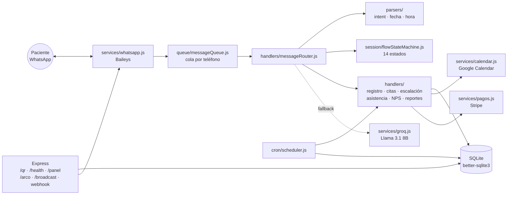

[English](README.en.md) · **Español**

# Bot de WhatsApp — Recepcionista IA para Consultorio Médico


Asistente conversacional de WhatsApp que actúa como **recepcionista virtual de una clínica médica mexicana**. Automatiza el ciclo completo de atención al paciente por chat: registro, agendamiento de citas con sincronización a Google Calendar, recordatorios, encuestas de satisfacción, cobro de anticipos y notificaciones al médico — todo en español natural, con detección de intenciones propia y un LLM (Groq) como respaldo conversacional.

> ⚠️ **Nota**: usa Baileys (cliente no oficial de WhatsApp). Para producción a gran escala se recomienda migrar a un BSP oficial (WATI, Gupshup, 360dialog).

---

## Características principales

### Gestión de citas de punta a punta
- **Registro de pacientes** conversacional (nombre, fecha de nacimiento) con recuperación de sesión perdida.
- **Agendar / reagendar / cancelar / consultar citas** con lenguaje natural mexicano ("pasado mañana a las 5 y media", "el martes en la tarde").
- **Sincronización con Google Calendar**: eventos tentativos con TTL mientras el paciente confirma, verificación de disponibilidad (free/busy) y limpieza automática de tentativos huérfanos al reiniciar.
- **Botones y listas interactivas** de WhatsApp (menú principal, confirmaciones, selección de horarios) con fallback a texto plano.

### Recordatorios y seguimiento automático
- Recordatorios de cita **24 h y 2 h antes** (cron cada 5 minutos).
- **Verificación de asistencia**: tras la cita, el bot pregunta al médico si el paciente asistió.
- **Felicitaciones de cumpleaños** diarias (9:00 AM).
- **Encuesta NPS post-consulta** enviada diariamente a las 19:00.

### Notificaciones al doctor
- Reporte pre-consulta con el **motivo de consulta** del paciente.
- **Escalamiento a humano**: ante urgencias o petición explícita, el bot alerta al médico y guarda silencio 30 minutos.
- **Triage de síntomas**: mensajes de emergencia (dolor de pecho, dificultad para respirar) se escalan en lugar de agendarse.
- Alerta operativa si la tasa de fallback al LLM supera el umbral (parser perdiendo intents).

### NLP híbrido (parser propio + LLM)
- **`intentParser`** con 18+ intenciones y mexicanismos; parsers dedicados de fechas, horas y números en español.
- **Groq (`llama-3.1-8b-instant`)** como fallback conversacional con personalidad definida ("Valentina", recepcionista empática) y límites estrictos: jamás diagnostica ni inventa citas.
- Máquina de estados de 14 estados que gobierna cada flujo conversacional (TTL de sesión: 10 min).

### Panel web y métricas
- **Panel de KPIs** (`/panel` JSON y `/panel.html` con gráficas): intents, fallbacks, citas creadas/canceladas, reagendamientos, escalaciones, urgencias y fallback rate a 7 días.
- **Series diarias** para gráficas (`/api/panel/series`, hasta 180 días).
- Métricas persistidas en SQLite por evento (intent detectado, fallback, pago, escalación...).

### Cumplimiento legal (LFPDPPP, México)
- **Aviso de privacidad** público versionado (`/aviso-privacidad`).
- **Opt-in explícito** con registro de versión de consentimiento.
- **Derechos ARCO**: baja por WhatsApp (palabra clave) y endpoints de acceso/cancelación de datos.

### Pagos y difusión
- **Anticipos con Stripe Checkout** (opcional, configurable en centavos) con webhook firmado y confirmación automática de la cita al pagar.
- **Broadcasts segmentados** con verificación de consentimiento previo.

---

## Arquitectura



**Flujo de un mensaje**: Baileys recibe el mensaje → se encola por teléfono (evita condiciones de carrera) → el router normaliza respuestas interactivas, carga la sesión y detecta la intención → el handler del flujo activo responde → si nada aplica, Groq genera una respuesta acotada. Todos los errores se capturan: el paciente siempre recibe una respuesta.

---

## Estructura del proyecto

```
bot-asistente-medica-whatsapp/
├── src/
│   ├── index.js               # Entry point: WhatsApp, cron, servidor HTTP
│   ├── config/
│   │   ├── env.js             # Carga y validación de variables de entorno
│   │   └── constants.js       # Estados, timeouts, modelo de Groq
│   ├── handlers/              # Lógica de negocio por flujo
│   │   ├── messageRouter.js   # Orquestador principal
│   │   ├── registrationFlow.js
│   │   ├── appointmentFlow.js
│   │   ├── reminderHandler.js
│   │   ├── attendanceHandler.js
│   │   ├── birthdayHandler.js
│   │   ├── escalationHandler.js
│   │   ├── npsHandler.js
│   │   └── reportHandler.js
│   ├── parsers/               # NLP en español (sin dependencias de LLM)
│   │   ├── intentParser.js    # 18+ intenciones
│   │   ├── dateParser.js      # "pasado mañana", "el martes"...
│   │   ├── timeParser.js      # "5 y media", "en la tarde"...
│   │   ├── spanishNumbers.js
│   │   └── textNormalizer.js
│   ├── services/
│   │   ├── whatsapp.js        # Baileys: conexión, filtros, botones/listas
│   │   ├── groq.js            # LLM fallback con system prompt acotado
│   │   ├── calendar.js        # Google Calendar (tentativos + freebusy)
│   │   ├── pagos.js           # Stripe Checkout
│   │   └── broadcast.js       # Difusión segmentada con consentimiento
│   ├── session/
│   │   ├── sessionManager.js  # Sesiones con TTL 10 min
│   │   └── flowStateMachine.js
│   ├── database/
│   │   ├── db.js · migrate.js
│   │   ├── migrations/        # 001-009 (schema, métricas, NPS, pagos...)
│   │   └── repositories/      # paciente · cita · medico · sesion · métricas · NPS · pago
│   ├── queue/messageQueue.js  # Serialización de mensajes por contacto
│   ├── cron/scheduler.js      # Recordatorios, cumpleaños, NPS, alertas
│   └── utils/                 # logger, plantillas de mensajes, fechas
├── public/panel.html          # Panel web de KPIs
├── scripts/migrate-from-sheets.js  # Importación de pacientes desde Excel
├── docs/                      # Manual del operador
└── tests/                     # Suite de pruebas (ver abajo)
```

---

## Requisitos

- **Node.js ≥ 24** (funciona desde 18, pero el proyecto se desarrolla y prueba en 24; `better-sqlite3` v12.x es requisito para Node 24)
- Un número de WhatsApp dedicado para el bot
- Cuenta de [Groq](https://console.groq.com) (capa gratuita: 14,400 req/día)
- *(Opcional)* Service Account de Google Cloud con acceso a Calendar API v3
- *(Opcional)* Cuenta de Stripe para cobro de anticipos

## Instalación

```bash
# 1. Clonar e instalar dependencias
git clone https://github.com/B0B1A6AE23/bot-asistente-medica-whatsapp.git
cd bot-asistente-medica-whatsapp
npm install

# 2. Configurar variables de entorno
cp .env.example .env
# ... editar .env con tus valores (ver tabla abajo)

# 3. Ejecutar migraciones de base de datos
npm run migrate

# 4. Iniciar el bot
npm start
```

Al arrancar, abre `http://localhost:3000/qr` y escanea el código con WhatsApp (**Dispositivos vinculados → Vincular dispositivo**). La sesión se persiste en `auth/`, por lo que solo se escanea una vez.

## Configuración (`.env`)

| Variable | Obligatoria | Descripción |
|---|---|---|
| `GROQ_API_KEY` | ✅ | API key de Groq (`gsk_...`) para el fallback conversacional |
| `DOCTOR_PHONE` | ✅ | Teléfono del médico con código de país, sin `+` (ej. `52XXXXXXXXXX`). Recibe reportes y alertas |
| `DOCTOR_NAME` | — | Nombre del médico mostrado en mensajes y prompt del LLM (ej. `Dr. Pérez`) |
| `CLINIC_NAME` | — | Nombre de la clínica que usa el bot al presentarse |
| `CLINIC_HOURS` | — | Horario de atención (ej. `Lunes a Viernes, 8:00 AM a 8:00 PM`) |
| `IGNORED_PHONES` | — | Teléfonos separados por coma que el bot ignora (útil si el número del bot es personal) |
| `API_SECRET_TOKEN` | — | Bearer token para endpoints protegidos (`/send-message`, `/panel`, `/arco`, `/broadcast`). Usa un valor largo y aleatorio |
| `GOOGLE_CREDENTIALS_PATH` | — | Ruta al JSON del Service Account (por defecto `./auth/google-credentials.json`) |
| `GOOGLE_CALENDAR_ID` | — | ID del calendario donde se crean los eventos. Vacío = Calendar deshabilitado |
| `PORT` | — | Puerto del servidor HTTP (por defecto `3000`) |
| `NODE_ENV` | — | `production` o `development` |

> 💡 Los pagos con Stripe son opcionales y se configuran mediante variables adicionales documentadas en `src/config/env.js` (con `PAGO_ANTICIPO_CENTAVOS=0` el flujo de cobro se omite por completo).

## Scripts

| Comando | Descripción |
|---|---|
| `npm start` | Inicia el bot (`node src/index.js`) |
| `npm run dev` | Modo desarrollo con recarga automática (`node --watch`) |
| `npm run migrate` | Aplica las migraciones de SQLite (001–009) |
| `npm run import-patients` | Importa pacientes desde un Excel/Sheets (`scripts/migrate-from-sheets.js`) |

## API HTTP

| Endpoint | Auth | Descripción |
|---|---|---|
| `GET /qr` | — | Página con el QR de vinculación de WhatsApp |
| `GET /health` | — | Estado del servicio y de la conexión de WhatsApp |
| `GET /aviso-privacidad` | — | Aviso de privacidad público (LFPDPPP) |
| `POST /send-message` | Bearer | Envía un mensaje de WhatsApp desde sistemas externos |
| `GET /panel` | Bearer | KPIs de los últimos 7 días (JSON) |
| `GET /panel.html` | token (query) | Panel web con gráficas |
| `GET /api/panel/series` | Bearer/token | Series diarias para las gráficas |
| `GET /arco/:telefono` | Bearer | Exporta los datos de un paciente (derecho de Acceso) |
| `DELETE /arco/:telefono` | Bearer | Baja de paciente + cancelación de citas (derecho de Cancelación) |
| `POST /broadcast` | Bearer | Difusión segmentada a pacientes con consentimiento |
| `POST /stripe-webhook` | firma Stripe | Confirmación de pagos (verificación de firma sobre raw body) |

## Suite de pruebas

La suite principal es **`tests/test-exhaustivo.js`**: simula conversaciones completas de usuarios mexicanos con mocks de Groq y Google Calendar, sin tocar servicios reales. Estado actual: **217 de 230 aserciones en verde**.

Los 13 casos que fallan están identificados y son de parsing, no de infraestructura: el coloquialismo `"nel"` como negativa, el typo `"sii"` como confirmación, y el flujo de cancelación cuando el paciente tiene tres citas activas simultáneas. Están en la suite a propósito, como red de seguridad para cuando se amplíe el `intentParser`.

```bash
node tests/test-exhaustivo.js
```

Suites complementarias por área:

| Archivo | Cobertura |
|---|---|
| `tests/test-exhaustivo.js` | Suite principal end-to-end (baseline obligatorio: 210/210) |
| `tests/test-completo.js` · `tests/test-suite.js` | Flujos conversacionales completos |
| `tests/test-asistencia.js` | Verificación de asistencia post-cita |
| `tests/test-cancelar-todas.js` | Cancelación múltiple de citas |
| `tests/test-doctor-notif.js` | Notificaciones y reportes al médico |
| `tests/test-metricas.js` | Registro de métricas en BD |
| `tests/test-panel-web.js` · `tests/test-nps-pagos.js` | Panel web, NPS y pagos |
| `tests/test-botones-texto.js` | Botones interactivos y fallback a texto |
| `tests/test-motivo-fix.js` · `tests/test-extras.js` · `tests/test-bot.js` | Regresiones puntuales |


## Limitaciones conocidas

- **Baileys es un cliente no oficial**: existe riesgo de bloqueo por parte de Meta ante patrones de envío masivo. El bot exige consentimiento explícito antes de cualquier broadcast como mitigación.
- **SQLite single-writer**: adecuado hasta ~10k pacientes; para multi-clínica se recomienda migrar a Postgres.
- Zona horaria asumida: `America/Mexico_City` (fechas en BD en hora local).

## Autor y licencia

**Ángel Josué García Cantero** — [github.com/AngelJGC](https://github.com/AngelJGC)

Distribuido bajo licencia **MIT**. Consulta el archivo `LICENSE` para más detalles.
